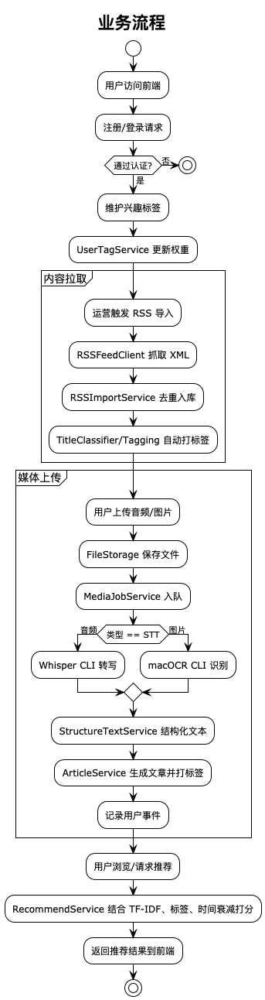

# News Recommend

基于 Kotlin/Spring Boot 与 Angular 构建的新闻推荐与多模态内容处理平台，支持 RSS 拉取、用户兴趣建模、音频转写与图片文字识别自动生成文章，并通过个性化推荐与标签体系提升阅读体验。

## 1. 技术栈
- **后端**：Kotlin 2.2、Spring Boot 3.5、Spring Security、Spring Validation、MyBatis、Ktor HTTP Client、Kotlin Coroutines、Jackson
- **数据层**：H2 文件数据库（自动建表与示例数据）、MyBatis XML 映射、基于 TF-IDF 的文本向量工具、知识图谱实体/关系表
- **推荐与智能处理**：TF-IDF + 余弦相似度推荐引擎、标题相似度分类器、关键词规则打标、Whisper CLI 语音转写、macOCR CLI 图片 OCR、OpenAI Responses API（结构化文本）、知识图谱同步服务
- **前端**：Angular 20、RxJS、Angular Router、CSS/HTML
- **工具链**：Gradle Wrapper、Node.js + pnpm、PlantUML、Python 3 + OpenAI SDK、Swift Package（Vision OCR CLI）

## 2. 功能概览
- **用户体系**：注册、登录、会话管理（Spring Security Session）、个人资料查看与兴趣标签维护
- **文章浏览**：按发布时间/创建时间分页浏览、文章详情页、相关文章回填、通用标签显示
- **个性化推荐**：基于用户历史行为、兴趣权重与文章新鲜度综合评分，支持推荐列表与文章页关联推荐
- **内容拉取与打标**：RSS 拉取去重入库、自动调用标题分类器/关键词规则打标签、标签词库可配置
- **媒体上传自动成稿**：音频上传（STT 转写）、图片上传（OCR 识别），调用结构化脚本生成标准化新闻稿并自动打标签、记录用户事件
- **知识图谱构建**：自动抽取用户—标签兴趣与文章—标签内容关系，写入 `knowledge_entities` 与 `knowledge_relations` 表，为多模态画像与解释提供基础
- **辅助能力**：文章标题标签推断 API、H2 后台控制台、媒体任务状态查询
- **前端页面**：最新文章、个性化推荐、文章详情、知识图谱、我的标签、音频/图片上传、登录、注册

## 3. 启动流程

### 后端服务
1. **环境准备**：安装 JDK 21、Python 3.11、Swift 工具链。
2. **配置检查**：`src/main/resources/application.yml` 提供默认 H2、Whisper、macOCR 配置，可根据实际路径调整；若需真实结构化输出，确保设置 `OPENAI_API_KEY` 环境变量。
3. **数据库初始化**：首次启动自动执行 `schema.sql` 与 `data.sql` 填充示例用户、标签与文章。
4. **运行服务**：
   ```bash
   ./gradlew bootRun
   ```
   服务默认监听 `http://localhost:8080`，启用基于 Session 的认证与 H2 控制台（`/h2`）。

### 前端应用
1. 安装 Node.js 20+ 与 pnpm（或使用 npm/yarn）。
2. 在 `ui` 目录安装依赖并启动：
   ```bash
   cd ui
   pnpm install
   pnpm start
   ```
3. 浏览器访问 `http://localhost:4200`，前端与后端通过同源 CORS 配置交互（会话需浏览器携带 Cookie）。

### 媒体处理与结构化文本
- **语音转写**：将 `app.stt.mode` 设为 `real`，配置 Whisper CLI (`app.stt.binaryPath`) 与模型文件路径 (`app.stt.modelPath`)，支持多语言设置。
- **macOCR CLI**：在 `tools/macocr` 下执行 `swift build -c release`，并将生成的可执行文件路径写入 `app.ocr.binPath`。
- **结构化脚本**：在 `tools/structure_text` 创建虚拟环境并安装依赖（`pip install openai` 等），设置 `OPENAI_API_KEY` 后即可由后端自动调用该脚本生成 `StructuredArticleDTO`。

## 4. 业务流程
1. **用户侧**：访客可注册或登录，登录后维护兴趣标签、浏览最新文章、获取个性化推荐或查看文章详情，浏览行为会反馈给推荐引擎更新画像。
2. **内容侧**： RSS 导入 / 用户上传音频或图片文件，识别结果经结构化脚本生成新闻稿，自动去重入库并根据标题/规则打标签，更新标题分类模型。
3. **推荐反馈**：用户浏览、点击或上传文章都会记录事件，推荐引擎利用 TF-IDF 画像、用户标签权重与文章新鲜度综合计算得分，在推荐接口中返回。


