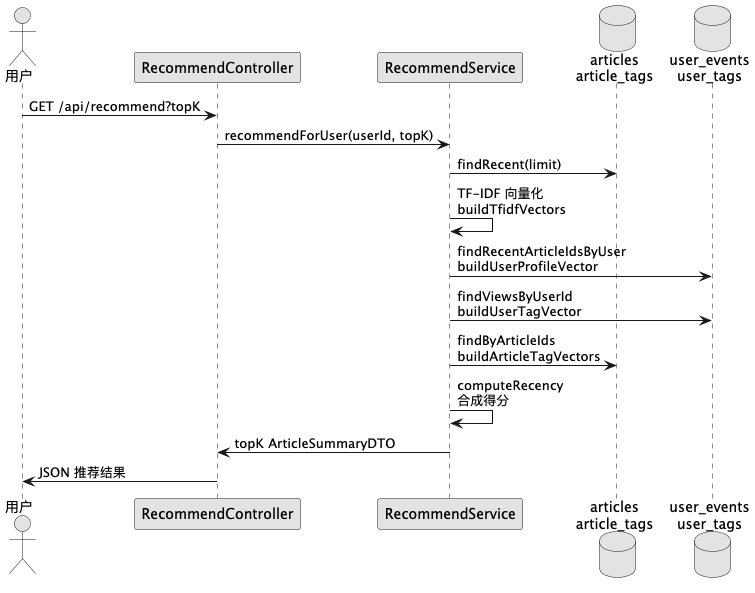

# 推荐算法代码详解

本文针对 `src/main/kotlin/io/sakurasou/newsrecommend/service/RecommendService.kt` 及其依赖组件进行详尽解析，帮助你全面理解项目中的个性化推荐实现。内容覆盖数据来源、特征构建、打分策略、配置参数以及与用户行为、标签体系之间的联动。

## 顶层工作流概览

Spring 控制器 `RecommendController` 在 `/api/recommend` 路由中调用 `RecommendService.recommendForUser`。后者围绕以下流程执行：

1. **候选集聚合**：从文章表中选出最近的 `candidateLimit` 篇文章，作为潜在推荐对象。 

   参考：`ArticleDAO.findRecent` 及 `application.yml` 中的 `app.reco.candidateLimit`。

2. **文本特征构建**：使用自定义 `TFIDFVectorizer` 对候选文章正文做分词、TF-IDF 向量化。

3. **用户画像估计**：基于最近的浏览事件，将对应文章向量求平均，形成用户内容向量。

4. **标签画像计算**：读取用户标签权重、文章标签，并归一化到 `[0, 1]`。

5. **新鲜度建模**：对发布时间做指数衰减，优先推荐近期文章。

6. **线性融合打分**：以配置中的 `alpha`、`beta` 为系数，对内容相似度、标签相似度、时间衰减求加权和。

7. **排序裁剪**：按得分降序截取 `topK`，再包装成 `ArticleSummaryDTO` 返回。

下图展示了推荐调用期间的关键数据流：



## 模块拆解

### 1. 候选集选择

- 入口：`recommendForUser` 首行调用 `articleDao.findRecent(appProperties.reco.candidateLimit)`。
- 依据 `application.yml` 默认配置，系统最多拿 1000 条最新文章；超过此数的新旧文章不会参与本轮推荐。
- 文章数据载体 `Article` 包含 `id/title/content/source/publishTime/createdAt` 等字段，时间相关字段用于后续新鲜度计算。

### 2. 正文向量化（内容画像）

`buildTfidfVectors` 将候选文章正文映射成稀疏向量，核心逻辑位于 `TFIDFVectorizer`：

```kotlin
// 文章内容 -> TF-IDF 稀疏向量
val contentMap = articles.associate { it.id!! to it.content }
val tfidfVectors = vectorizer.vectorize(contentMap)
```

`TFIDFVectorizer` 的关键步骤：

1. **分词**：`TextUtils.tokenize` 使用正则 `[^\\p{IsLetter}\\p{IsDigit}\\p{IsHan}]+` 切分字符，同时过滤常见中英文停用词。
2. **词频统计**：每个文档构造 `term frequency (tf)`，值为词出现次数 / 文档总词数。
3. **逆文档频率**：依据 `ln((totalDocs + 1) / (df + 1)) + 1` 计算 `idf`。
4. **向量拼装**：对每个文档产生 `Map<Int, Double>`，键为词汇索引，值为 `tf * idf`。

回到推荐逻辑，若候选列表为空，服务立即返回；否则继续构建用户画像。

TF-IDF（Term Frequency–Inverse Document Frequency，词频–逆文档频率）是一种把**文本转换为向量**的经典方法：它用“词在当前文档中有多重要（TF）”乘以“词在整个语料里有多稀有（IDF）”，从而突出关键字、抑制常见虚词。

- **TF（词频）**：一个词在该文档中出现得越多，越重要。常见定义：
  $$
  tf(t,d)=\frac{\text{词 }t\text{ 在文档 }d\text{ 中出现的次数}}{\text{文档 }d\text{ 的总词数}}
  $$
  也可以用原始计数、对数缩放等变体。

- **IDF（逆文档频率）**：一个词在越多文档里都出现，就越“不具有区分性”，应被降权。常见的平滑写法：
  $$
  idf(t)=\ln\!\Big(\frac{N+1}{df(t)+1}\Big)+1
  $$
  其中 $N$ 为语料文档总数，$df(t)$ 为包含词 $t$ 的文档数。

- **TF-IDF 权重**：
  $$
  w(t,d)=tf(t,d)\times idf(t)
  $$
  对每个词算出 $w(t,d)$，按固定词表顺序排成向量（稀疏）。

### 3. 用户内容画像

`buildUserProfileVector` 通过用户最近历史来估计偏好：

```kotlin
val historyIds = userEventDao.findRecentArticleIdsByUser(userId, historyLimit = 20)
val aggregated = historyVectors.reduce(sum)
return aggregated.mapValues { it.value / relevant.size }
```

- 数据来源：`user_events` 表，`ArticleService.recordEvent` 在用户浏览 (`VIEW`)、点击 (`CLICK`) 或上传 (`UPLOAD`) 时插入记录。
- 只取最近 20 条事件，保证画像更贴近当前兴趣。
- 若历史为空或历史文章暂未在候选集中出现，则返回空向量，后续余弦相似度自动退化为 0。

### 4. 标签画像与归一化

标签向量是内容画像的重要补充，用于缓解文本稀疏或冷启动问题。

1. **用户标签向量**：`buildUserTagVector`
   - 来自 `user_tags` 表（DAO：`UserTagDAO.findViewsByUserId`），存储用户显式选择或行为推断出的标签及权重。
   - 以当前用户的最大权重归一化，保证向量值在 `[0, 1]` 之间，避免个体偏好强度差异导致分布失衡。
2. **文章标签向量**：`buildArticleTagVectors`
   - 从 `article_tags` 表批量取出权重，并按每篇文章的最大值归一化。
   - 这些标签通常来自 `ArticleAutoTagService`，后者会综合标题分类器（基于 TF-IDF + 相似度的 `TitleClassifierService`）及规则系统 (`TaggingService`) 自动赋权。

当某一侧缺失时，相似度 `CosineSimilarity.cosineDense` 会返回 0，保障打分计算稳定。

### 5. 新鲜度衰减

`computeRecency` 采用指数衰减模型：

```kotlin
val deltaHours = Duration.between(publishTime, now).toHours().coerceAtLeast(0)
return exp(-deltaHours / tauHours)
```

- `tauHours = max(1.0, recentDays * 24.0)`，默认 `recentDays = 14`，即半衰期约为两周。
- 若文章缺少 `publishTime`，则回落到 `createdAt`，确保新鲜度总能计算。
- 输出位于 `(0, 1]`，发布时间越接近当前时刻，值越接近 1。

### 6. 线性融合打分

最终分数为：

```text
score = α * contentScore + (1 - α) * tagScore + β * recency
```

- `contentScore`：`CosineSimilarity.cosine(articleVector, profileVector)`
- `tagScore`：`CosineSimilarity.cosineDense(articleTagVector, userTagVector)`
- `recency`：指数衰减结果
- `α (alpha)`：控制内容 vs 标签的权重；默认 `0.5`，即两者各占一半。
- `β (beta)`：新鲜度补偿系数，默认 `0.05`，确保最新文章在同等内容/标签得分下具备优势。

实现细节：

```kotlin
val score = alpha * contentScore + (1 - alpha) * tagScore + beta * recency
val bounded = score.coerceIn(0.0, 1.0)
```

- 通过 `coerceIn` 将得分限制在 `[0, 1]`，避免数值异常。
- 使用 SLF4J `logger.debug` 记录候选数量与平均得分，便于监控分布情况。

### 7. 排序与响应构建

`scores.sortedByDescending { it.second }.take(topK)` 按最高分取前 `topK` 条（上限 50）。随后拉取所有标签名称映射，构造成精简的 `ArticleSummaryDTO`：

- `summary = article.content.take(200)`：截取正文前 200 个字符。
- `tags = articleTagVectors[article.id]?.keys?.mapNotNull { tagNamesById[it] }`：将标签 id 映射成文本标签。
- `score` 字段保留最终得分，方便前端展示或调试。

## 用户行为与标签更新链路

推荐效果依赖高质量的标签和行为数据，项目在以下位置维护这些信息：

- `ArticleService.recordEvent`：记录每次 `VIEW/CLICK/UPLOAD`，并调用 `UserTagService.incrementWeights` 按文章标签权重的 10% 增加用户标签兴趣。若用户尚无对应标签，则自动插入。
- `UserTagService.incrementWeights`：将权重封顶在 `maxWeight = 2.0`，避免兴趣过度膨胀；更新后同步到 `KnowledgeGraphService`，方便其它模块复用。
- `ArticleAutoTagService.applyByTitle`：优先用标题分类器预测标签；若失败则回退到 `TaggingService` 的关键词规则方案。无论哪种方式，最终都会写入 `article_tags` 并同步知识图谱。

这一闭环保证了用户画像随行为演进、文章标签随内容新增而更新，为推荐提供持续可用的特征。

## 配置与调参建议

| 参数 | 位置 | 默认值 | 作用与建议 |
| --- | --- | --- | --- |
| `app.reco.candidateLimit` | `application.yml` | `1000` | 控制候选集规模；增大可提高覆盖，但会线性增加向量化与相似度计算开销。 |
| `app.reco.alpha` | `application.yml` | `0.5` | 内容相似度 vs 标签相似度的平衡系数；若标签可靠度更高，可调高。 |
| `app.reco.beta` | `application.yml` | `0.05` | 新鲜度影响力；新闻场景可适当提升，长尾内容则可减小。 |
| `app.reco.recentDays` | `application.yml` | `14` | 决定 recency 衰减速度；值越小，系统越偏好最新文章。 |
| `historyLimit` | `RecommendService.buildUserProfileVector` | `20` | 用户画像来源的事件条数；根据活跃度和存储成本调整。 |

调整策略可以通过 A/B 测试或离线评估（如 NDCG、CTR）验证，从而在相关性与多样性之间取得平衡。

## 异常与降级策略

- **冷启动**：当用户没有历史行为或标签数据时，内容/标签相似度自动变为 0，最终得分退化为 `β * recency`，实际表现为推荐最新文章，可视为“热门推荐”模式。
- **缺少文章向量**：若个别文章空内容或向量构建失败，`vectorizer` 会返回空 Map，余弦相似度回落到 0，整体流程不受影响。
- **标签缺失**：文章或用户标签为空时，标签相似度为 0，不会干扰其它信号。
- **时间异常**：对发布时间早于当前的文章才计算正值；若文章时间晚于当前（例如未来时间），通过 `coerceAtLeast(0)` 避免负数。

## 测试与排查建议

1. **单元测试**：可对 `TFIDFVectorizer`、`CosineSimilarity`、`computeRecency` 等纯函数编写测试验证数学正确性。
2. **集成测试**：构造真实的文章、用户标签样本，验证 `recommendForUser` 排序结果是否符合预期。
3. **调试日志**：启用 `logging.level.io.sakurasou.newsrecommend=DEBUG`（默认已开启），观察平均得分是否异常，或候选集是否过少。
4. **数据稽核**：定期检查 `user_tags`、`article_tags` 表，确保权重在合理区间，避免标签雪崩/失衡。

---

通过以上拆解，可以看出推荐算法兼顾了 **内容相似度**、**标签画像** 与 **时效性**，结构清晰且易于扩展。你可以在此基础上继续引入协同过滤、知识图谱扩展、重排序模型等能力，以逐步提升推荐效果。
